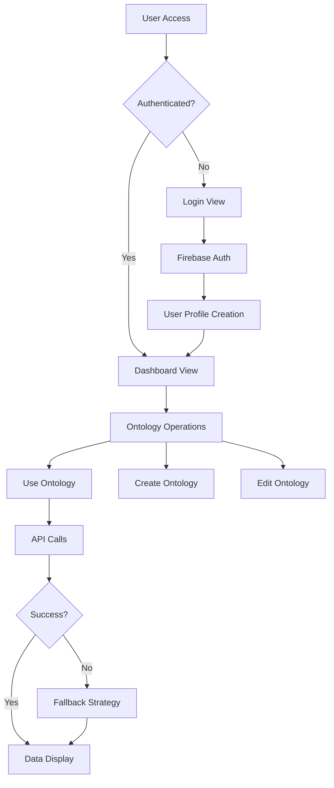
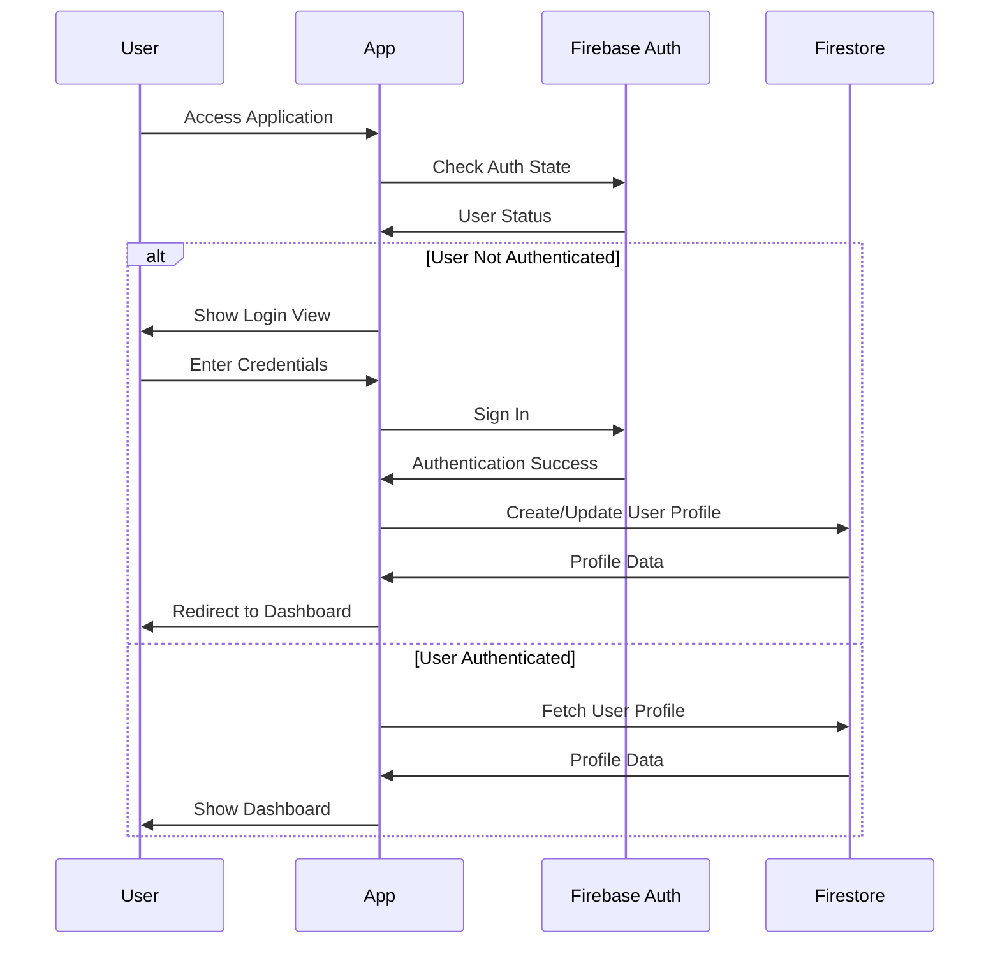

# Ontology Market Place Application - Comprehensive Codebase Analysis

**Document Version:** 1.0  
**Last Updated:** December 2024  
**Project Type:** React TypeScript Web Application  
**Domain:** Knowledge Graph Management & Ontology Operations  

---

## Table of Contents

1. [Executive Summary](#executive-summary)
2. [Project Overview](#project-overview)
3. [Technical Architecture](#technical-architecture)
4. [Core Components Analysis](#core-components-analysis)
5. [Service Layer Deep Dive](#service-layer-deep-dive)
6. [Authentication & Security](#authentication--security)
7. [Data Flow & State Management](#data-flow--state-management)
8. [Error Handling & Resilience](#error-handling--resilience)
9. [UI/UX Implementation](#uiux-implementation)
10. [Development & Deployment](#development--deployment)
11. [Code Quality & Best Practices](#code-quality--best-practices)

---

## Executive Summary

The Ontology Market Place is a web application built with React 18 and TypeScript, designed to manage and interact with knowledge graphs (ontologies). 

**Key Strengths:**
- Modern React architecture with TypeScript
- Comprehensive Firebase integration
- Robust error handling with fallback strategies
- Professional-grade UI/UX with Tailwind CSS
- Scalable service-oriented architecture


---

## Project Overview

### Technology Stack

| Category | Technology | Version | Purpose |
|----------|------------|---------|---------|
| **Frontend Framework** | React | 18.3.1 | UI Component Library |
| **Language** | TypeScript | 5.5.3 | Type Safety & Development Experience |
| **Build Tool** | Vite | 5.4.2 | Fast Development & Building |
| **Styling** | Tailwind CSS | 3.4.1 | Utility-First CSS Framework |
| **Backend** | Firebase | 10.7.1 | Authentication, Database, Functions |
| **State Management** | React Hooks | Built-in | Component State & Effects |
| **Code Quality** | ESLint | 9.9.1 | Code Linting & Standards |
| **Package Manager** | npm | Latest | Dependency Management |

### Project Structure

```
src/
├── components/          # Reusable UI components
├── config/             # Configuration files (Firebase, etc.)
├── services/           # Business logic and API services
├── views/              # Page-level components
├── App.tsx            # Main application component
├── main.tsx           # Application entry point
└── index.css          # Global styles
```

---

## Technical Architecture

### Architectural Patterns

The application follows several key architectural patterns:

1. **Component-Based Architecture**: Modular React components with clear responsibilities
2. **Service-Oriented Architecture**: Business logic separated into service classes
3. **Repository Pattern**: Data access abstracted through service interfaces
4. **Observer Pattern**: Authentication state changes propagated through listeners
5. **Strategy Pattern**: Multiple fallback strategies for error handling

### Application Flow



---

## Core Components Analysis

### 1. Main Application Component (`src/App.tsx`)

The `App.tsx` component serves as the application's orchestrator, managing navigation, authentication state, and user interface rendering.

#### State Management Architecture

```typescript
// Core application state
const [currentView, setCurrentView] = useState<ViewType>('login');
const [selectedOntologyId, setSelectedOntologyId] = useState<string | null>(null);
const [mobileMenuOpen, setMobileMenuOpen] = useState(false);
const [currentUser, setCurrentUser] = useState<User | null>(null);
const [showSettings, setShowSettings] = useState(false);
const [isLoading, setIsLoading] = useState(true);
```

**Key Responsibilities:**
- **View Management**: Controls which view is currently displayed
- **Authentication State**: Manages user login/logout and profile data
- **Navigation**: Handles routing between different application sections
- **Responsive Design**: Manages mobile navigation state
- **User Settings**: Controls profile settings modal display

#### Authentication Integration

```typescript
useEffect(() => {
  // Listen for authentication state changes
  const unsubscribe = authService.onAuthStateChange((user) => {
    setCurrentUser(user);
    if (user) {
      setCurrentView('dashboard');
    } else {
      setCurrentView('login');
    }
    setIsLoading(false);
  });

  // Check if user is already authenticated
  const user = authService.getCurrentUser();
  if (user) {
    setCurrentUser(user);
    setCurrentView('dashboard');
  }
  setIsLoading(false);

  return unsubscribe;
}, []);
```

**Implementation Details:**
- **Observer Pattern**: Uses Firebase's `onAuthStateChanged` to listen for authentication changes
- **Automatic Navigation**: Redirects authenticated users to dashboard
- **Memory Management**: Properly unsubscribes from auth listeners
- **Loading States**: Manages loading indicators during authentication checks

#### Navigation System

```typescript
const navigationItems = [
  { id: 'dashboard' as ViewType, label: 'Dashboard' },
  { id: 'use-ontology' as ViewType, label: 'Use Ontology' },
  { id: 'new-ontology' as ViewType, label: 'Create New' },
];

const handleViewChange = (view: string, ontologyId?: string) => {
  setCurrentView(view as ViewType);
  if (ontologyId) {
    setSelectedOntologyId(ontologyId);
  }
  setMobileMenuOpen(false);
};
```

**Features:**
- **Type-Safe Navigation**: Uses TypeScript union types for view identification
- **Parameter Passing**: Supports passing ontology IDs between views
- **Mobile Responsiveness**: Automatically closes mobile menu on navigation
- **State Synchronization**: Maintains selected ontology context across views

### 2. Use Ontology View (`src/views/UseOntologyView.tsx`)

The `UseOntologyView` component is the primary interface for ontology interaction, featuring a sophisticated dual-panel layout for selection and preview functionality.

#### Component Architecture

```typescript
export const UseOntologyView: React.FC<UseOntologyViewProps> = ({ onNavigate }) => {
  // State management for ontology operations
  const [showMerged, setShowMerged] = useState(true);
  const [selectedOntologyId, setSelectedOntologyId] = useState<string | null>(null);
  const [isLoading, setIsLoading] = useState(false);
  const [error, setError] = useState<string | null>(null);
  const [ontologies, setOntologies] = useState<Ontology[]>([]);
  const [isLoadingOntologies, setIsLoadingOntologies] = useState(false);
  const [previewData, setPreviewData] = useState<Ontology[]>([]);
  const [isLoadingPreview, setIsLoadingPreview] = useState(false);
```

**State Variables Explanation:**
- **`showMerged`**: Controls whether to merge or replace existing data during uploads
- **`selectedOntologyId`**: Tracks the currently selected ontology for operations
- **`isLoading`**: Manages upload operation loading states
- **`error`**: Stores and displays error messages to users
- **`ontologies`**: Maintains the list of available ontologies
- **`isLoadingOntologies`**: Controls loading states for ontology fetching
- **`previewData`**: Stores preview information for display
- **`isLoadingPreview`**: Manages preview data loading states

#### Data Loading Strategy

```typescript
const loadOntologies = async () => {
  setIsLoadingOntologies(true);
  setError(null);
  
  try {
    const result = await ontologyService.getOntologies();
    if (result.error) {
      setError(result.error);
      setOntologies([]);
    } else {
      setOntologies(result.ontologies);
    }
  } catch (error) {
    const errorMessage = error instanceof Error ? error.message : 'Failed to load ontologies';
    setError(errorMessage);
    setOntologies([]);
  } finally {
    setIsLoadingOntologies(false);
  }
};
```

**Error Handling Features:**
- **Graceful Degradation**: Continues operation even when errors occur
- **User Feedback**: Provides clear error messages to users
- **State Consistency**: Ensures UI state remains consistent during errors
- **Loading Management**: Properly manages loading states in all scenarios

#### Upload Functionality

```typescript
const handleUpload = async () => {
  if (!selectedOntologyId) {
    alert('Please select an ontology first');
    return;
  }
  
  setIsLoading(true);
  setError(null);
  
  try {
    // Call Firebase function to upload ontology to database
    const result = await FirebaseFunctionCaller.uploadToDatabase(
      selectedOntologyId,
      'neo4j', // or 'postgres', 'mysql', etc.
      showMerged ? 'merge' : 'replace'
    );
    
    // Show success message
    alert('Ontology uploaded successfully!');
    
  } catch (error) {
    setError(error instanceof Error ? error.message : 'Upload failed');
  } finally {
    setIsLoading(false);
  }
};
```

**Upload Features:**
- **Database Flexibility**: Supports multiple database types (Neo4j, PostgreSQL, MySQL)
- **Merge/Replace Options**: Allows users to choose data handling strategy
- **Validation**: Ensures ontology selection before upload
- **Progress Feedback**: Provides loading states and success/error messages

#### UI Layout Structure

The component implements a sophisticated dual-panel layout:

```typescript
return (
  <div className="min-h-screen bg-gray-50 p-4 sm:p-6">
    <div className="max-w-7xl mx-auto">
      <div className="grid grid-cols-1 lg:grid-cols-2 gap-6">
        {/* Selected Ontology Panel */}
        <div className="bg-white rounded-lg shadow-sm border p-6">
          {/* Ontology selection and details */}
        </div>

        {/* Ontology Preview Panel */}
        <div className="bg-white rounded-lg shadow-sm border p-6">
          {/* Preview data and upload controls */}
        </div>
      </div>
    </div>
  </div>
);
```

**Layout Features:**
- **Responsive Design**: Adapts from single-column mobile to dual-column desktop
- **Card-Based UI**: Clean, modern interface with shadow and border styling
- **Consistent Spacing**: Uses Tailwind's spacing system for uniform layout
- **Visual Hierarchy**: Clear separation between selection and preview areas

### 3. Ontology Selector Component (`src/components/OntologySelector.tsx`)

The `OntologySelector` is a sophisticated dropdown component that provides ontology selection with search, filtering, and visual indicators.

#### Component Interface

```typescript
interface OntologySelectorProps {
  selectedId: string | null;
  onSelect: (id: string) => void;
  onNavigate: (view: string, ontologyId?: string) => void;
  ontologies: Ontology[];
  isLoading?: boolean;
}
```

**Props Analysis:**
- **`selectedId`**: Currently selected ontology identifier
- **`onSelect`**: Callback for ontology selection changes
- **`onNavigate`**: Navigation handler for creating new ontologies
- **`ontologies`**: Array of available ontologies
- **`isLoading`**: Optional loading state indicator

#### Search and Filtering Implementation

```typescript
const filteredOntologies = ontologies.filter(ontology => {
  const name = ontology.name || '';
  const description = ontology.description || '';
  const query = searchQuery.toLowerCase();
  
  return name.toLowerCase().includes(query) ||
         description.toLowerCase().includes(query);
});
```

**Filtering Features:**
- **Multi-Field Search**: Searches both name and description fields
- **Case-Insensitive**: Provides user-friendly search experience
- **Real-Time Filtering**: Updates results as user types
- **Fallback Handling**: Gracefully handles missing or undefined fields

#### Visual Indicators and Metadata

```typescript
<div className="flex flex-wrap gap-1 mt-2">
  <span className={`inline-flex items-center px-2 py-0.5 rounded-full text-xs font-medium ${
    isPublic 
      ? 'bg-green-100 text-green-800' 
      : 'bg-gray-100 text-gray-800'
  }`}>
    {isPublic ? 'Public' : 'Private'}
  </span>
  
  {hasSource && (
    <span className="inline-flex items-center px-2 py-0.5 rounded-full text-xs font-medium bg-blue-100 text-blue-800">
      Has Source
    </span>
  )}
</div>
```

**Visual Features:**
- **Status Badges**: Color-coded indicators for ontology properties
- **Conditional Rendering**: Shows relevant metadata based on ontology state
- **Accessibility**: Uses semantic colors and clear labeling
- **Responsive Design**: Adapts to different screen sizes

---

## Service Layer Deep Dive

### 1. Ontology Service (`src/services/ontologyService.ts`)

The ontology service is the core business logic layer, handling all ontology-related operations with sophisticated error handling and fallback strategies.

#### Service Architecture

```typescript
class OntologyService {
  private readonly baseUrl = 'https://us-central1-ontology-marketplace-efv1v3.cloudfunctions.net';
  private fallbackUsed = false;
  private lastFallbackReason = '';

  // Public methods for ontology operations
  async searchOntologies(): Promise<OntologyResponse>
  async addOntology(ontology: Omit<Ontology, 'id' | 'createdAt' | 'updatedAt' | 'ownerId'>): Promise<AddOntologyResponse>
  async getOntologies(): Promise<{ ontologies: Ontology[]; error?: string }>
  async createOntology(name: string, description: string, isPublic: boolean, sourceUrl?: string, imageUrl?: string): Promise<{ ontology?: Ontology; error?: string }>
}
```

**Service Design Principles:**
- **Single Responsibility**: Focuses solely on ontology operations
- **Dependency Injection**: Receives configuration through constructor
- **State Tracking**: Monitors fallback usage for debugging
- **Async Operations**: All external calls are asynchronous

#### Data Normalization Strategy

```typescript
const normalizedOntologies = (data.ontologies || data || []).map((ontology: any) => {
  // Handle date conversion - Firestore timestamps come as objects with _seconds
  const parseDate = (dateValue: any): Date => {
    if (!dateValue) return new Date();
    
    // If it's a Firestore timestamp object
    if (dateValue && typeof dateValue === 'object' && dateValue._seconds) {
      return new Date(dateValue._seconds * 1000);
    }
    
    // If it's already a Date object
    if (dateValue instanceof Date) {
      return dateValue;
    }
    
    // If it's a string or number, try to parse it
    try {
      return new Date(dateValue);
    } catch (e) {
      console.warn('Failed to parse date:', dateValue);
      return new Date();
    }
  };

  return {
    id: ontology.id,
    name: ontology.title || ontology.name || 'Untitled Ontology',
    description: ontology.description || '',
    properties: {
      source_url: ontology.file_url || ontology.source_url || ontology.properties?.source_url || '',
      image_url: ontology.image_url || ontology.properties?.image_url || '',
      is_public: ontology.is_public ?? ontology.properties?.is_public ?? false
    },
    ownerId: ontology.ownerId || ontology.uid || '',
    createdAt: parseDate(ontology.createdAt || ontology.created_time),
    updatedAt: parseDate(ontology.updatedAt || ontology.createdAt || ontology.created_time),
    // Preserve additional fields
    node_count: ontology.node_count,
    relationship_count: ontology.relationship_count,
    file_url: ontology.file_url,
    uid: ontology.uid
  };
});
```

**Normalization Features:**
- **Field Mapping**: Handles different API response formats
- **Date Parsing**: Robust date handling for various timestamp formats
- **Fallback Values**: Provides sensible defaults for missing data
- **Data Preservation**: Maintains additional metadata fields

#### Multi-Level Fallback Strategy

The service implements a sophisticated fallback system with five distinct strategies:

```typescript
private handleSearchFallback(error: any): OntologyResponse {
  const errorMessage = error instanceof Error ? error.message : 'Unknown error';
  
  // Strategy 1: Network/CORS errors - return development mock data
  if (errorMessage.includes('NetworkError') || 
      errorMessage.includes('CORS') || 
      errorMessage.includes('Failed to fetch')) {
    return {
      success: true,
      data: this.getDevelopmentFallbackData()
    };
  }
  
  // Strategy 2: Authentication errors - return empty with auth error
  if (errorMessage.includes('Unauthorized') || 
      errorMessage.includes('401') ||
      errorMessage.includes('authentication')) {
    this.fallbackUsed = true;
    this.lastFallbackReason = 'Authentication error';
    return {
      success: false,
      error: 'Authentication failed. Please log in again.',
      data: []
    };
  }
  
  // Strategy 3: Server errors (5xx) - return cached data if available
  if (errorMessage.includes('500') || 
      errorMessage.includes('502') || 
      errorMessage.includes('503') ||
      errorMessage.includes('Internal server error')) {
    this.fallbackUsed = true;
    this.lastFallbackReason = 'Server error (5xx)';
    return {
      success: true,
      data: this.getCachedFallbackData(),
      error: 'Using cached data due to server issues'
    };
  }
  
  // Strategy 4: Rate limiting or temporary issues
  if (errorMessage.includes('429') || 
      errorMessage.includes('rate limit') ||
      errorMessage.includes('temporary')) {
    this.fallbackUsed = true;
    this.lastFallbackReason = 'Rate limiting';
    return {
      success: true,
      data: this.getMinimalFallbackData(),
      error: 'Rate limited - showing limited data'
    };
  }
  
  // Strategy 5: Generic fallback for unknown errors
  this.fallbackUsed = true;
  this.lastFallbackReason = 'Unknown error';
  return {
    success: false,
    error: `Failed to load ontologies: ${errorMessage}`,
    data: []
  };
}
```

**Fallback Strategy Benefits:**
- **Development Continuity**: Allows development to continue during network issues
- **User Experience**: Provides meaningful feedback for different error types
- **Debugging Support**: Tracks which fallback strategy was used
- **Graceful Degradation**: Maintains application functionality during failures

#### Development Mock Data

```typescript
private getDevelopmentFallbackData(): Ontology[] {
  return [
    {
      id: 'dev-1',
      name: 'Medical Ontology (Dev)',
      description: 'Sample medical terminology ontology for development',
      properties: {
        source_url: 'https://example.com/medical.owl',
        image_url: 'https://via.placeholder.com/150',
        is_public: true
      },
      ownerId: 'dev-user',
      createdAt: new Date(),
      updatedAt: new Date()
    },
    {
      id: 'dev-2',
      name: 'E-commerce Catalog (Dev)',
      description: 'Sample product categorization ontology',
      properties: {
        source_url: 'https://example.com/ecommerce.owl',
        image_url: 'https://via.placeholder.com/150',
        is_public: false
      },
      ownerId: 'dev-user',
      createdAt: new Date(),
      updatedAt: new Date()
    },
    {
      id: 'dev-3',
      name: 'Academic Research (Dev)',
      description: 'Sample academic research ontology',
      properties: {
        source_url: 'https://example.com/academic.owl',
        image_url: 'https://via.placeholder.com/150',
        is_public: true
      },
      ownerId: 'dev-user',
      createdAt: new Date(),
      updatedAt: new Date()
    }
  ];
}
```

**Mock Data Features:**
- **Realistic Content**: Provides believable sample data for development
- **Variety**: Includes different ontology types and visibility settings
- **Consistent Structure**: Follows the same data format as real ontologies
- **Development Focus**: Clearly marked as development data

### 2. Authentication Service (`src/services/authService.ts`)

The authentication service provides a comprehensive wrapper around Firebase Authentication with additional user profile management capabilities.

#### Service Architecture

```typescript
class AuthService {
  private currentUser: User | null = null;
  private authStateListeners: ((user: User | null) => void)[] = [];

  constructor() {
    // Listen for authentication state changes
    onAuthStateChanged(auth, async (firebaseUser) => {
      if (firebaseUser) {
        try {
          const user = await this.createUserFromFirebaseUser(firebaseUser);
          this.currentUser = user;
          await this.updateLastLogin(user.id);
        } catch (error) {
          console.error('Error in auth state change:', error);
          this.currentUser = null;
        }
      } else {
        this.currentUser = null;
      }
      
      // Notify all listeners
      this.authStateListeners.forEach(listener => listener(this.currentUser));
    });
  }
}
```

**Architecture Features:**
- **Observer Pattern**: Manages multiple authentication state listeners
- **Firebase Integration**: Seamlessly integrates with Firebase Auth
- **User Profile Management**: Extends Firebase user data with custom fields
- **Error Handling**: Robust error handling for authentication failures

#### User Profile Management

```typescript
private async createUserFromFirebaseUser(firebaseUser: FirebaseUser): Promise<User> {
  try {
    const userDoc = await getDoc(doc(db, 'users', firebaseUser.uid));
    const userData = userDoc.data();

    return {
      id: firebaseUser.uid,
      name: userData?.name || firebaseUser.displayName || 'User',
      email: firebaseUser.email || '',
      photoURL: firebaseUser.photoURL || undefined,
      createdAt: userData?.createdAt?.toDate(),
      lastLoginAt: new Date()
    };
  } catch (error) {
    console.error('Error creating user from Firebase user:', error);
    console.log('Using fallback user data');
    
    // Fallback to basic user data if Firestore fails
    return {
      id: firebaseUser.uid,
      name: firebaseUser.displayName || 'User',
      email: firebaseUser.email || '',
      photoURL: firebaseUser.photoURL || undefined,
      lastLoginAt: new Date()
    };
  }
}
```

**Profile Management Features:**
- **Firestore Integration**: Stores additional user data in Firestore
- **Fallback Strategy**: Provides basic user data if Firestore fails
- **Data Enrichment**: Extends Firebase user data with custom fields
- **Last Login Tracking**: Monitors user activity for analytics

#### Authentication Methods

```typescript
// Sign in with Google
async signInWithGoogle(): Promise<User> {
  try {
    const provider = new GoogleAuthProvider();
    const userCredential = await signInWithPopup(auth, provider);
    const firebaseUser = userCredential.user;

    // Check if this is a new user and create/update their document
    const userDoc = await getDoc(doc(db, 'users', firebaseUser.uid));
    
    if (!userDoc.exists()) {
      // New user - create document
      const userData = {
        name: firebaseUser.displayName || 'User',
        email: firebaseUser.email || '',
        createdAt: new Date(),
        lastLoginAt: new Date()
      };
      await setDoc(doc(db, 'users', firebaseUser.uid), userData);
    }

    return await this.createUserFromFirebaseUser(firebaseUser);
  } catch (error: any) {
    throw this.handleAuthError(error);
  }
}
```

**Authentication Features:**
- **Multiple Providers**: Supports email/password and Google OAuth
- **User Creation**: Automatically creates user profiles for new users
- **Profile Updates**: Maintains user data consistency
- **Error Handling**: Comprehensive error handling with user-friendly messages

#### Error Handling System

```typescript
private handleAuthError(error: any): AuthError {
  const errorMessages: Record<string, string> = {
    'auth/user-not-found': 'No account found with this email address.',
    'auth/wrong-password': 'Incorrect password.',
    'auth/email-already-in-use': 'An account with this email already exists.',
    'auth/weak-password': 'Password should be at least 6 characters.',
    'auth/invalid-email': 'Invalid email address.',
    'auth/user-disabled': 'This account has been disabled.',
    'auth/too-many-requests': 'Too many failed attempts. Please try again later.',
    'auth/network-request-failed': 'Network error. Please check your connection.',
    'auth/popup-closed-by-user': 'Sign-in popup was closed before completion.',
    'auth/cancelled-popup-request': 'Sign-in was cancelled.',
    'auth/requires-recent-login': 'Please sign in again to perform this action.'
  };

  return {
    code: error.code || 'auth/unknown-error',
    message: errorMessages[error.code] || error.message || 'An unexpected error occurred.'
  };
}
```

**Error Handling Features:**
- **User-Friendly Messages**: Translates technical errors to understandable text
- **Comprehensive Coverage**: Handles all common Firebase authentication errors
- **Fallback Handling**: Provides generic error messages for unknown errors
- **Consistent Format**: Returns structured error objects for consistent handling

---

## Authentication & Security

### Firebase Configuration

The application uses Firebase for authentication, database, and cloud functions, with environment variable-based configuration for security.

```typescript
const firebaseConfig = {
  apiKey: import.meta.env.VITE_FIREBASE_API_KEY,
  authDomain: import.meta.env.VITE_FIREBASE_AUTH_DOMAIN,
  projectId: import.meta.env.VITE_FIREBASE_PROJECT_ID,
  storageBucket: import.meta.env.VITE_FIREBASE_STORAGE_BUCKET,
  messagingSenderId: import.meta.env.VITE_FIREBASE_MESSAGING_SENDER_ID,
  appId: import.meta.env.VITE_FIREBASE_APP_ID
};
```

**Security Features:**
- **Environment Variables**: Sensitive configuration stored in environment files
- **API Key Protection**: Firebase API keys are not exposed in source code
- **Domain Restrictions**: Auth domain restrictions prevent unauthorized access
- **Project Isolation**: Separate project IDs for different environments

### Authentication Flow



### Security Measures

1. **JWT Token Authentication**: All API calls use Firebase ID tokens
2. **User Profile Validation**: User data is validated before processing
3. **Session Management**: Automatic session handling with Firebase
4. **Error Sanitization**: Sensitive error information is not exposed to users

---

## Data Flow & State Management

### State Management Architecture

The application uses React's built-in state management with hooks, implementing a unidirectional data flow pattern.

#### Component State Hierarchy

```typescript
// App Level State
const [currentView, setCurrentView] = useState<ViewType>('login');
const [selectedOntologyId, setSelectedOntologyId] = useState<string | null>(null);
const [currentUser, setCurrentUser] = useState<User | null>(null);

// View Level State
const [ontologies, setOntologies] = useState<Ontology[]>([]);
const [isLoading, setIsLoading] = useState(false);
const [error, setError] = useState<string | null>(null);

// Component Level State
const [isOpen, setIsOpen] = useState(false);
const [searchQuery, setSearchQuery] = useState('');
```

#### Data Flow Patterns

1. **Top-Down Data Flow**: Data flows from parent to child components
2. **Callback Communication**: Child components communicate changes via callbacks
3. **Service Layer Integration**: Business logic handled by service classes
4. **State Synchronization**: Shared state managed at appropriate levels

### API Integration Flow

```typescript
// Data fetching pattern
const loadData = async () => {
  setIsLoading(true);
  setError(null);
  
  try {
    const result = await service.method();
    if (result.success) {
      setData(result.data);
    } else {
      setError(result.error);
    }
  } catch (error) {
    setError(error.message);
  } finally {
    setIsLoading(false);
  }
};
```

**Pattern Benefits:**
- **Consistent Error Handling**: Uniform error handling across all API calls
- **Loading State Management**: Proper loading state management for user feedback
- **Error State Management**: Clear error state handling and display
- **Async Operation Safety**: Safe handling of asynchronous operations

---

## Error Handling & Resilience

### Multi-Layer Error Handling Strategy

The application implements a comprehensive error handling strategy with multiple fallback mechanisms.

#### Error Handling Layers

1. **Component Level**: Immediate error handling and user feedback
2. **Service Level**: Business logic error handling and fallback strategies
3. **Network Level**: Network error handling with offline capabilities
4. **Application Level**: Global error handling and recovery

#### Fallback Strategy Implementation

```typescript
// Component level error handling
const handleOperation = async () => {
  try {
    const result = await service.operation();
    if (result.success) {
      // Handle success
    } else {
      setError(result.error);
    }
  } catch (error) {
    setError(error.message);
  }
};

// Service level fallback
private handleSearchFallback(error: any): OntologyResponse {
  if (error.message.includes('NetworkError')) {
    return { success: true, data: this.getDevelopmentFallbackData() };
  }
  if (error.message.includes('Unauthorized')) {
    return { success: false, error: 'Authentication failed', data: [] };
  }
  // Additional fallback strategies...
}
```

### Error Recovery Mechanisms

1. **Automatic Retry**: Automatic retry for transient failures
2. **Fallback Data**: Development and cached data for offline scenarios
3. **User Notification**: Clear error messages with recovery suggestions
4. **Graceful Degradation**: Application continues to function with reduced features

---

## UI/UX Implementation

### Design System

The application uses Tailwind CSS for styling, implementing a consistent design system with:

- **Color Palette**: Consistent color scheme with semantic meaning
- **Typography**: Unified typography scale and hierarchy
- **Spacing**: Consistent spacing system using Tailwind's scale
- **Components**: Reusable component patterns with consistent styling

### Responsive Design

```typescript
// Mobile-first responsive design
<div className="grid grid-cols-1 lg:grid-cols-2 gap-6">
  {/* Single column on mobile, two columns on large screens */}
</div>

// Responsive navigation
<nav className="hidden md:flex items-center space-x-6 ml-8">
  {/* Hidden on mobile, visible on medium screens and up */}
</nav>
```

**Responsive Features:**
- **Mobile-First Approach**: Designed for mobile devices first
- **Breakpoint System**: Uses Tailwind's responsive breakpoints
- **Adaptive Layout**: Layout adapts to different screen sizes
- **Touch-Friendly**: Optimized for touch interactions

### Accessibility Features

1. **Semantic HTML**: Proper use of HTML semantic elements
2. **ARIA Labels**: Appropriate ARIA labels for screen readers
3. **Keyboard Navigation**: Full keyboard navigation support
4. **Color Contrast**: Adequate color contrast for readability
5. **Focus Management**: Proper focus management for accessibility

---

## Development & Deployment

### Build System

The application uses Vite as the build tool, providing:

- **Fast Development**: Hot module replacement for rapid development
- **Optimized Builds**: Efficient production builds with tree shaking
- **TypeScript Support**: Native TypeScript support without additional configuration
- **Plugin Ecosystem**: Rich plugin ecosystem for additional functionality

### Development Scripts

```json
{
  "scripts": {
    "dev": "vite",
    "build": "vite build",
    "lint": "eslint .",
    "preview": "vite preview"
  }
}
```

**Script Purposes:**
- **`dev`**: Starts development server with hot reload
- **`build`**: Creates optimized production build
- **`lint`**: Runs ESLint for code quality checks
- **`preview`**: Previews production build locally

### Environment Configuration

The application uses environment variables for configuration:

```bash
# .env.local
VITE_FIREBASE_API_KEY=your_api_key
VITE_FIREBASE_AUTH_DOMAIN=your_project.firebaseapp.com
VITE_FIREBASE_PROJECT_ID=your_project_id
VITE_FIREBASE_STORAGE_BUCKET=your_project.appspot.com
VITE_FIREBASE_MESSAGING_SENDER_ID=your_sender_id
VITE_FIREBASE_APP_ID=your_app_id
```

**Configuration Benefits:**
- **Environment Separation**: Different configs for development/production
- **Security**: Sensitive data not committed to source control
- **Flexibility**: Easy configuration changes without code modifications
- **Deployment Safety**: Prevents accidental exposure of production credentials

---

## Code Quality & Best Practices

### TypeScript Implementation

The application demonstrates excellent TypeScript usage:

```typescript
// Strict typing for all interfaces
export interface Ontology {
  id?: string;
  name: string;
  description: string;
  properties: {
    source_url?: string;
    image_url?: string;
    is_public: boolean;
  };
  createdAt?: Date;
  updatedAt?: Date;
  ownerId?: string;
}

// Generic type constraints
async function<T extends BaseType>(data: T): Promise<Result<T>> {
  // Implementation
}
```

**TypeScript Benefits:**
- **Type Safety**: Compile-time error detection
- **IntelliSense**: Enhanced development experience
- **Refactoring Safety**: Safe code refactoring with confidence
- **Documentation**: Types serve as living documentation

### Code Organization

1. **Separation of Concerns**: Clear separation between UI, business logic, and data
2. **Single Responsibility**: Each component and service has a single, well-defined purpose
3. **Dependency Injection**: Services receive dependencies through constructor injection
4. **Interface Segregation**: Clean interfaces that don't force unnecessary dependencies

### Error Handling Patterns

```typescript
// Consistent error handling pattern
try {
  const result = await operation();
  if (result.success) {
    handleSuccess(result.data);
  } else {
    handleError(result.error);
  }
} catch (error) {
  handleUnexpectedError(error);
} finally {
  cleanup();
}
```


